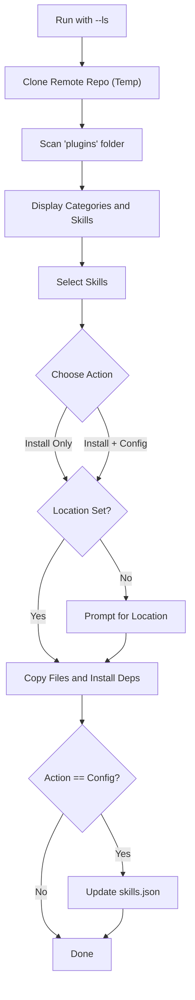
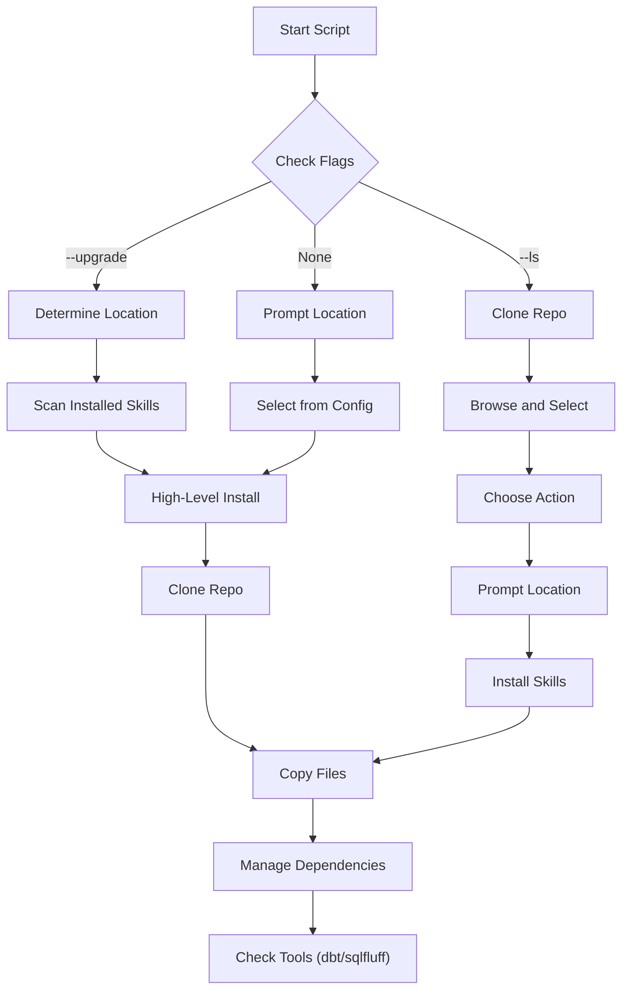

# Skills Manager Utility

[English](README.md) | [中文](README_zh.md)

A cross-platform toolset to manage, discover, and install Agent Skills from a shared repository (`wshobson/agents`) into your local development environment (VS Code or Claude Desktop).

## Key Features
*   **Cross-Platform**: Works on Windows, macOS, and Linux.
*   **Remote Discovery**: Browse and search skills directly from the remote repository without manual configuration.
*   **Smart Updates**: Check for updates on installed skills.
*   **Dependency Management**: Automatically handles `requirements.txt` and specific tools (like `dbt`, `sqlfluff`).
*   **Multiple Targets**: Support for VS Code (Global/Project) and Claude Desktop.
*   **Environment Check**: Validates Python, Pip, Git, and Version Managers (uv/pyenv).
*   **Internationalization**: Built-in support for English and Chinese Interfaces.

---

## 1. Quick Start

### Windows
1.  **Setup Environment**: Run the check script to ensure Python/Pip/Git/uv are ready.
    ```powershell
    .\setup_env.ps1
    ```
    *Follow prompts to install missing tools (supports installing Python/uv via Winget).*

2.  **Run Installer**:
    ```cmd
    .\install_skills.cmd
    ```

### macOS / Linux
1.  **Setup Environment**:
    ```bash
    chmod +x setup_env.sh install_skills.sh
    ./setup_env.sh
    ```

2.  **Run Installer**:
    ```bash
    ./install_skills.sh
    ```

---

## 2. Interactive Discovery (`--ls`)

Instead of manually editing configuration files, you can browse the remote repository for available skills.

```bash
# Windows
.\install_skills.cmd --ls

# macOS/Linux
./install_skills.sh --ls
```

**Workflow:**
1.  **Browse**: Valid skills are fetched and grouped by category (e.g., `data-engineering`, `software-dev`).
2.  **Select**: Choose specific skills to download.
3.  **Action**:
    *   **Install Only**: Downloads the skill for immediate use.
    *   **Install & Save**: Downloads AND adds the skill to your local `skills.json` for future updates.

### Discovery Process Flow


---

## 3. Installation & Updates

### Installation Targets
When running interactively, you can choose where to install:
1.  **Global VS Code**: `~/.vscode/skills` (Accessible by all projects)
2.  **Project**: `./skills` (Local workspace)
3.  **Claude Desktop**: Auto-detected path (e.g., `%APPDATA%\Claude\skills`)
4.  **Custom**: Any path you specify

### Command Line Types

| Flag | Description |
| :--- | :--- |
| `--ls` | **Browse Mode**: Discover and install remote skills interactively. |
| `--upgrade` | **Update Mode**: Checks all currently installed skills in the target directory and updates them if they match `skills.json`. |
| `--global-install` | Target the VS Code user directory. |
| `--project-install` | Target the current working directory. |
| `--claude-install` | Target the Claude Desktop configuration directory. |
| `--lang` | Specify interface language explicitly (`en` or `zh`). |
| `--yes` / `-y` | Skip confirmation prompts (useful for scripts). |

> **Tip**: You can enter `q` or `Q` at any interactive prompt to exit the tool.

### Examples

**Update all skills in the current project:**
```bash
python install_skills.py --project-install --upgrade
```

**Install specifically for Claude Desktop (Chinese Interface):**
```bash
python install_skills.py --claude-install --ls --lang zh
```

---

## 4. Configuration (`skills.json`)

The `skills.json` file maps a local skill name to its path in the remote Git repository.

*   **Automatic**: When using `--ls` with "Install and Add to Configuration", this file is updated automatically.
*   **Manual**: You can edit it manually to add private or custom mappings.

```json
{
    "repo_url": "https://github.com/wshobson/agents.git",
    "skills": {
        "sql-patterns": "plugins/developer-essentials/skills/sql-optimization-patterns",
        "dbt-patterns": "plugins/data-engineering/skills/dbt-transformation-patterns"
    }
}
```

---

## 5. Technical Architecture

### Installation Logic


---

## 6. Credits & Acknowledgment

This project wouldn't be possible without the community resources it builds upon.

### Source Repository
*   **Repo**: [wshobson/agents](https://github.com/wshobson/agents)
*   **Author**: We gratefully acknowledge the work of [Seth Hobson](https://github.com/wshobson) for curating and maintaining the comprehensive list of agent skills used by this installer.

### AI Generation
This utility (including Python scripts, PowerShell/Bash automations, and documentation) was entirely generated by AI.
*   **Tool**: GitHub Copilot in VS Code
*   **Model**: Gemini 3 Pro (Preview)
