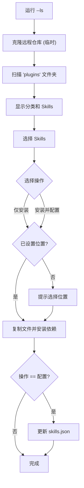
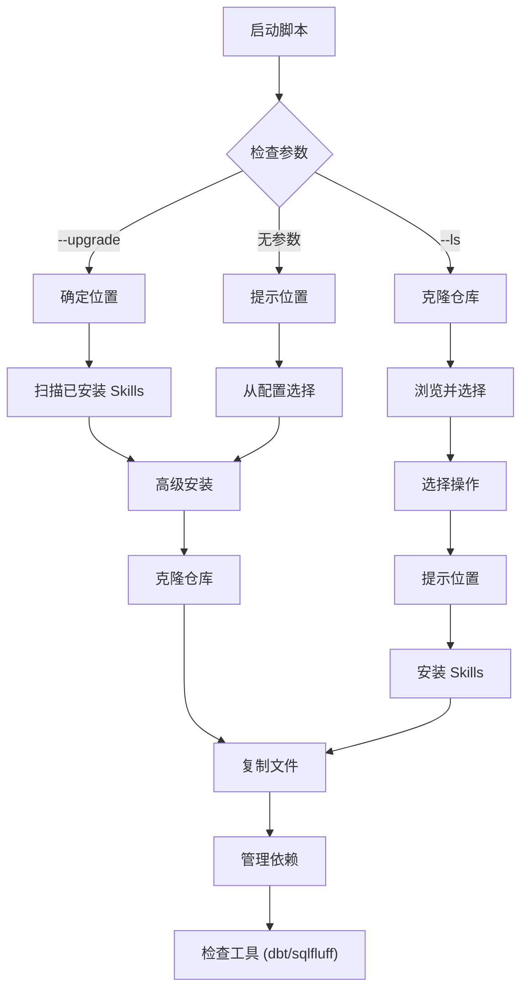

# Skills Manager 实用工具

[English](README.md) | [中文](README_zh.md)

这是一个跨平台的工具集，用于管理、发现 Agent Skills 并将其从共享仓库 (`wshobson/agents`) 安装到本地开发环境（VS Code 或 Claude Desktop）中。

## 主要功能
*   **跨平台**：支持 Windows、macOS 和 Linux。
*   **远程发现**：直接浏览和搜索远程仓库中的 Skills，无需手动配置。
*   **智能更新**：检查已安装 Skills 的更新。
*   **依赖管理**：自动处理 `requirements.txt` 和特定工具（如 `dbt`、`sqlfluff`）。
*   **多目标支持**：支持 VS Code（全局/项目）和 Claude Desktop。
*   **环境检查**：验证 Python、Pip、Git 和版本管理器（uv/pyenv）。

---

## 1. 快速开始

### Windows
1.  **设置环境**：运行检查脚本以确保 Python/Pip/Git/uv 就绪。
    ```powershell
    .\setup_env.ps1
    ```
    *按照提示安装缺失的工具（支持通过 Winget 安装 Python/uv）。*

2.  **运行安装程序**：
    ```cmd
    .\install_skills.cmd
    ```

### macOS / Linux
1.  **设置环境**：
    ```bash
    chmod +x setup_env.sh install_skills.sh
    ./setup_env.sh
    ```

2.  **运行安装程序**：
    ```bash
    ./install_skills.sh
    ```

---

## 2. 交互式发现 (`--ls`)

您无需手动编辑配置文件，即可浏览远程仓库中的可用 Skills。

```bash
# Windows
.\install_skills.cmd --ls

# macOS/Linux
./install_skills.sh --ls
```

**工作流程：**
1.  **浏览**：获取有效的 Skills 并按类别分组（例如 `data-engineering`, `software-dev`）。
2.  **选择**：选择要下载的具体 Skills。
3.  **操作**：
    *   **仅安装 (Install Only)**：下载 Skill 以便立即使用。
    *   **安装并配置 (Install & Save)**：下载并将其添加到本地 `skills.json` 以便未来更新。

### 发现流程图


---

## 3. 安装与更新

### 安装目标
在交互模式下运行时，您可以选择安装位置：
1.  **全局 VS Code**: `~/.vscode/skills`（所有项目可用）
2.  **项目**: `./skills`（当前工作区）
3.  **Claude Desktop**: 自动检测路径（例如 `%APPDATA%\Claude\skills`）
4.  **自定义**: 您指定的任何路径

### 命令行参数

| 标志 | 说明 |
| :--- | :--- |
| `--ls` | **浏览模式**：交互式地发现并安装远程 Skills。 |
| `--upgrade` | **更新模式**：检查目标目录中当前已安装的所有 Skills，如果它们与 `skills.json` 匹配则进行更新。 |
| `--global-install` | 目标为 VS Code 用户目录。 |
| `--project-install` | 目标为当前工作目录。 |
| `--claude-install` | 目标为 Claude Desktop 配置目录。 |
| `--yes` / `-y` |以此跳过确认提示（适用于脚本）。 |

### 示例

**更新当前项目中的所有 Skills：**
```bash
python install_skills.py --project-install --upgrade
```

**专门为 Claude Desktop 安装：**
```bash
python install_skills.py --claude-install --ls
```

---

## 4. 配置 (`skills.json`)

`skills.json` 文件将本地 Skill 名称映射到远程 Git 仓库中的路径。

*   **自动**：使用 `--ls` 并选择“安装并配置”时，此文件会自动更新。
*   **手动**：您可以手动编辑它以添加私有或自定义映射。

```json
{
    "repo_url": "https://github.com/wshobson/agents.git",
    "skills": {
        "sql-patterns": "plugins/developer-essentials/skills/sql-optimization-patterns",
        "dbt-patterns": "plugins/data-engineering/skills/dbt-transformation-patterns"
    }
}
```

---

## 5. 技术架构

### 安装逻辑


---

## 6. 鸣谢

该项目建立在社区资源之上，没有它们就不可能有这个项目。

### 源仓库
*   **仓库**: [wshobson/agents](https://github.com/wshobson/agents)
*   **作者**: 我们非常感谢 [Seth Hobson](https://github.com/wshobson) 整理和维护了本安装程序使用的 comprehensive agent skills 列表。

### AI 生成
本实用工具（包括 Python 脚本、PowerShell/Bash 自动化脚本和文档）完全由 AI 生成。
*   **工具**: GitHub Copilot in VS Code
*   **模型**: Gemini 3 Pro (Preview)
